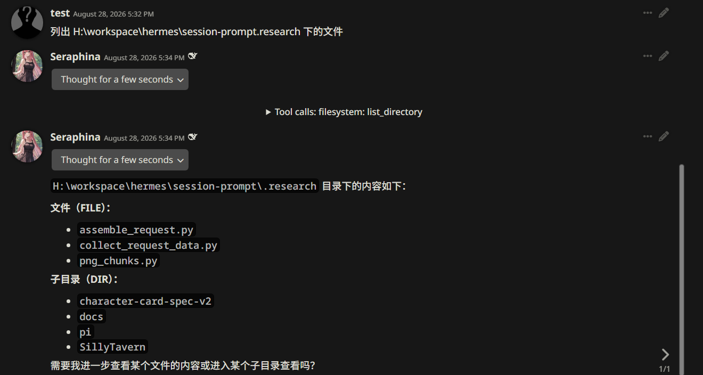
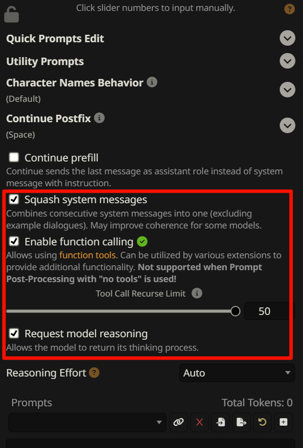
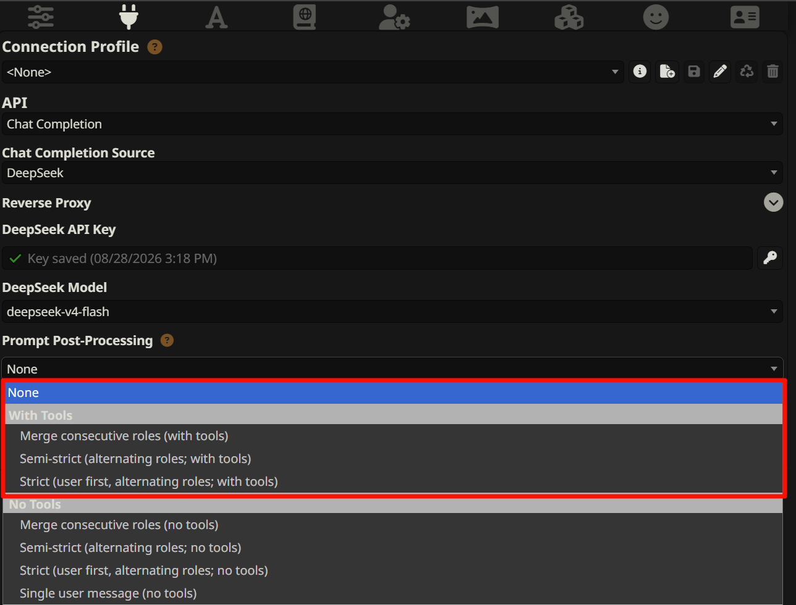

# SillyHands

> 基于 [SillyTavern](https://github.com/SillyTavern/SillyTavern)，SillyHands 让你的 SillyTavern 拥有 Pi Coding Agent 风格的工具调用能力，让你的角色拥有双手，可以检索本地信息、编辑本地文件或检索网络信息。

SillyHands 在保留官方 SillyTavern 全部能力（多后端 LLM 接入、角色卡、世界书、提示词组装、扩展体系）的基础上，围绕「让聊天模型真正能调用外部工具」这一目标做了一系列工程化改造：内置 MCP 桥四服务器、本地化 filesystem 服务器、Tavily 网页搜索、desktop-commander 终端执行，以及一套跨平台一键部署脚本——**git clone 之后即可在 Windows / Linux / WSL / Termux 上直接运行**。

---

## 效果展示

网络信息检索


本地文件操作与检索


## 基于 SillyTavern 的改进

### 1. MCP 工具桥一体化（核心）

开箱内置 **4 个 MCP 服务器**（配置见 `data/default-user/mcp_settings.json`）：

| 服务器 | 启动方式 | 工具数 | 能力 |
|---|---|---|---|
| **filesystem** | `node scripts/mcp-fs/dist/index.js`（**本地化**，随仓库分发） | 14 | 文件读写/目录/编辑/搜索（白名单目录内） |
| **web** | `npx -y html-extractor-mcp` | 4 | 网页抓取（fetch_url / extract_text / extract_links / fetch_json，Playwright 引擎） |
| **desktop-commander** | `npx -y @wonderwhy-er/desktop-commander` | 26 | 终端命令执行 / 进程管理 / 文件操作 / 流式搜索 |
| **tavily** | `npx -y tavily-mcp` | 5 | 网页搜索（tavily_search / extract / crawl / map / research） |

合计 **49 个工具**，通过社区 MCP 桥（`plugins/SillyTavern-MCP-Server` + 前端 `MCP-Client` 扩展）接入 ST 原生的 function calling 管线——模型在对话中即可真实读写文件、抓网页、执行命令、搜索互联网。

### 2. filesystem 服务器本地化

- 启动参数中的白名单目录**按部署设备修改**（仓库默认 `H:/workspace`，Linux/Termux 上请改为对应路径，例如 `/home/<user>/workspace`）。

### 3. Tavily 网页搜索

新增 `tavily-mcp` 服务器（5 个搜索类工具），API Key 通过 ST 前端 Secret 管理配置（`TAVILY`）。适合需要「联网查资料再回答」的场景。

### 4. desktop-commander 终端执行

- Windows 默认 shell 已配置为 **git-bash**（`~/.claude-server-commander/config.json` 的 `defaultShell`）；
- 命令执行默认**全权限**；
- 内置 **30 项危险命令黑名单**（`mkfs`/`format`/`dd`/`sudo`/`shutdown` 等）兜底。

### 5. DeepSeek thinking 模式修复

针对 DeepSeek 官方 API 在工具链（多轮 tool call）场景下要求 `reasoning_content` 字段的处理做了修复，保证带思考模式的模型在工具调用链中不报错。

### 6. 一键部署脚本

| 文件 | 平台 | 作用 |
| --- | --- | --- |
| `mcp_config_install.sh` | Linux / WSL / macOS / Termux | 安装 ST 主依赖 + `scripts/mcp-fs` 依赖；`--prefetch` |
| `mcp_config_install.sh` | Linux / WSL / macOS / Termux | 安装 ST 主依赖 + `scripts/mcp-fs` 依赖；`--prefetch` 可预下载 npx 服务器包 |
| `mcp_config_install.bat` | Windows | 等价于 .sh，ASCII-only（GBK 安全） |
| `start.sh` | Linux / WSL / Termux | 启动前自动安装缺失依赖（幂等） |

## 新设备部署指南

### 前置要求

- **Node.js >= 20**（含 npm），git
- 网络：首次启动 `web` / `desktop-commander` / `tavily` 服务器需要联网（npx 按需下载）；`--prefetch` 可提前预取

### Linux / WSL / Termux

```bash
# 1. 拉取仓库
git clone https://github.com/Centaurea162/SillyHands.git
cd SillyHands

# 2. 一键安装依赖（幂等，可重复执行；可选 --prefetch 预下载 npx 包）
./mcp_config_install.sh            # 或 ./mcp_config_install.sh --prefetch

# 3. 启动
./start.sh                          # 或 node server.js
```

### Windows

```bat
git clone https://github.com/Centaurea162/SillyHands.git
cd SillyHands
mcp_config_install.bat
start.bat          REM 或 node server.js
```

### 部署后必做
1. **启用工具调用功能**：SillyTavern 官方已经内置了 Harness 程序必须的工具调用循环(function calling loop)，但默认关闭。预设配置已启用，但若导入新配置，需要手动启用。设置如下配置即可:

2. **配置带有工具信息的提示词**：提示词中需带有工具信息，LLM才会进行工具调用。选如下四个选项之一即可:

3. **修改 filesystem 白名单目录**：编辑白名单目录，让 filesystem 只可修改白名单目录下的文件，防止非预期变更。 `data/default-user/mcp_settings.json`，把 `filesystem` 的 `args` 中 `H:/workspace` 改为本机实际路径（Linux 示例：`/home/ubuntu/workspace`），然后重启 ST；
4. **浏览器访问** `http://localhost:8000`，首次访问创建管理员账号；
5. **验证 MCP**：扩展设置 → MCP Client → Enable 勾选，四个服务器自动连接；Manage Tools 中应能看到 49 个工具（filesystem 14 / web 4 / desktop-commander 26 / tavily 5）；
6. **配置搜索引擎能力**： SillyHands使用搜索引擎的能力借助了第三方平台Tavily(仅抓取网页无需借助Tavily，但检索效率低)，需要配置Tavily key才能使用搜索功能。在https://app.tavily.com/home 注册账号获取Key之后, 编辑`data/default-user/mcp_settings.json`里的`"TAVILY_API_KEY": "替换成你的Tavily Key"`字段后即可使用。平台赠送免费用户一个月1000次搜索额度。

---

## ⚠️注意事项⚠️

- **desktop-commander 为全权限终端，理论上可以修改任意目录的文件**：仅建议在可信对话中使用；`~/.claude-server-commander/config.json` 可配置 `defaultShell` / `blockedCommands`；如果想要禁用 desktop-commander，编辑`data/default-user/mcp_settings.json`里 在 `"disabledServers": []` 替换为 `"disabledServers": ["desktop-commander"]`，禁用后filesystem仍可完成绝大部分文件操作，且保证只操作白名单目录下的文件。
- **虽然理论上 SillyHands 拥有和Pi Coding Agent相同的能力，但不推荐将 SillyHands 作为 Harness 进行代码开发。**

---

## 版本与环境基准

- 基础版本：SillyTavern 1.18.0（release）
- MCP 桥：`SillyTavern-MCP-Server`（bmen25124 社区版，随仓库分发于 `plugins/`）
- 本地化 filesystem：`scripts/mcp-fs/`（官方源码 + 本仓库配置）
